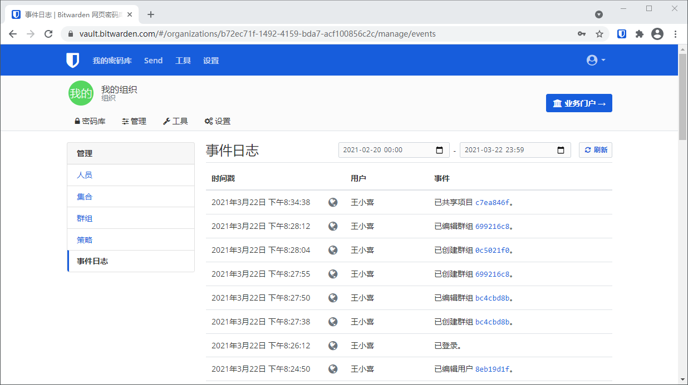

# 事件日志


对应的[官方文档地址](https://bitwarden.com/help/article/event-logs/)


事件日志是团队或企业组织内发生的事件的时间戳记录。管理员和所有者可以从组织密码库的**报告**选项卡访问事件日志：



事件日志可以从 [Bitwarden 公共 API](../../organizations/bitwarden-public-api.md) 的 `/events` 端点访问和导出，并无限期保留。大多数事件捕获在各种 Bitwarden 客户端中采取的操作，这些客户端每 60 秒将事件数据推送到服务器，因此您可能会注意到最近事件报告中有轻微的延迟。

## 检查事件 <a href="#inspect-events" id="inspect-events"></a>

在 Web 应用程序的**事件日志**视图中，选择一个粉红色的资源标识符（例如 `1e685004`）将做两件事：

1. 打开一个对话框，其中包含与该资源关联的事件列表。例如，选择一个项目的标识符将打开该项目被编辑、查看等的时间列表，包括哪个成员执行的每个操作。
2. 导航到您访问资源的视图。例如，从**事件日志**中选择成员的标识符将带您进入**成员**视图并自动将列表过滤到该成员。

## 事件列表 <a href="#events-list" id="events-list"></a>

事件日志记录了超过 50 种不同类型的事件。事件日志界面捕捉事件的**时间戳**、包含了应用程序的类型和 IP （通过悬停在 **🌎**地球图标上访问）的客户端应用程序信息、连接到事件的**用户**、以及**事件**的描述。


每一个**事件**都使用类型代码（`1000`、`1001` 等）关联，以标识事件所捕获的操作。[Bitwarden 公共 API](../../organizations/bitwarden-public-api.md) 使用类型代码来标识被事件所记录的操作。


下面列出了所有事件类型及其相应的类型代码：

### 用户事件 <a href="#user-events" id="user-events"></a>

* Logged In. (`1000`)
* Changed account password. (`1001`)
* Enabled/updated two-step login. (`1002`)
* Disabled two-step login. (`1003`)
* Recovered account from two-step login. (`1004`)
* Login attempted failed with incorrect password. (`1005`)
* Login attempt failed with incorrect two-step login. (`1006`)
* User Exported their personal Vault items. (`1007`)
* User updated a password issued through [Admin Password Reset](../../organizations/admin-password-reset.md). (`1008`)
* User migrated their decryption key with [Key Connector](../../login-with-sso/about-key-connector.md). (`1009`)

### 项目事件 <a href="#item-events" id="item-events"></a>

* Created item _item-identifier_. (`1100`)
* Edited item _item-identifier_. (`1101`)
* Permanently Deleted item _item-identifier_. (`1102`)
* Created attachment for item _item-identifier_. (`1103`)
* Deleted attachment for item _item-identifier_. (`1104`)
* Shared item _item-identifier_. (`1105`)
* Edited collections for item _item-identifier_ (`1106`)
* Viewed item _item-identifier_. (`1107`)
* Viewed password for item _item-identifier_. (`1108`)
* Viewed hidden field for item _item-identifier_. (`1109`)
* Viewed security code for item _item-identifier_. (`1110`)
* Copied password for item _item-identifier_. (`1111`)
* Copied hidden field for item _item-identifier_. (`1112`)
* Copied security code for item _item-identifier_. (`1113`)
* Auto-filled item _item-identifier_. (`1114`)
* Sent item _item-identifier_ to trash. (`1115`)
* Restored item _item-identifier_. (`1116`)
* Viewed Card Number for item item-identifier. (`1117`)

### 集合事件 <a href="#collection-events" id="collection-events"></a>

* Created collection _collection-identifier_. (`1300`)
* Edited collection _collection-identifier_. (`1301`)
* Deleted collection _collection-identifier_. (`1302`)

### 群组事件 <a href="#group-events" id="group-events"></a>

* Created group _group-identifier_. (`1400`)
* Edited group _group-identifier_. (`1401`)
* Deleted group _group-identifier_. (`1402`)

### 组织事件 <a href="#organization-events" id="organization-events"></a>

* Invited user _user-identifier_. (`1500`)
* Confirmed user _user-identifier_. (`1501`)
* Edited user _user-identifier_. (`1502`)
* Removed user _user-identifier_. (`1503`)
* Edited groups for user _user-identifier_. (`1504`)
* Unlinked SSO. (`1505`)
* _user-identifier_ enrolled in Master Password Reset. (`1506`)
* _user-identifier_ withdrew from Master Password Reset. (`1507`)
* Master Password was reset for _user-identifier_. (`1508`)
* Reset SSO link for user _user-identifier_. (`1509`)
* _user-identifer_ logged in using SSO for the first time. (`1510`)
* Revoked organization access for _user-identifier_ (`1511`)
* Restores organization access for _user-identifier_ (`1512`)
* Edited organization settings. (`1600`)
* Purged organization vault. (`1601`)
* Exported organization vault. (`1602`)
* Organization Vault access by a managing [Provider](../../provider-portal/provider-portal-overview.md). (`1603`)
* Organization enabled SSO. (`1604`)
* Organization disabled SSO. (`1605`)
* Organization enabled Key Connector. (`1606`)
* Organization disabled Key Connector. (`1607`)
* Families Sponsorships synced. (`1608`)
* Updated a Policy. (`1700`)
* Added domain _domain-name_. (`2000`)
* Removed domain _domain-name_. (`2001`)
* _Domain-name_ verified. (`2002`)
* _Domain-name_ not verified. (`2003`)

### 提供商事件 <a href="#provider-events" id="provider-events"></a>

当[管理提供商](../../provider-portal/provider-portal-overview.md)的成员触发上述任何事件时，**用户**栏将记录提供商的名称。此外，每当管理提供商的成员访问您的组织密码库时，专用于提供商的事件也将被记录：

{% embed url="https://bitwarden.com/_gatsby/image/9256acb3a7ba030f5ac3a769b5da4d5a/90d6e053b2285f9d4ed55c24ec1c7a7b/Screen_Shot_2023-02-01_at_3.34.38_PM.webp?eu=d98a59e3e29af986093bf2d56d26663fe13f04aff85237d26c6ce1ae1ca89b8121a24c5725907eb17d385bd7dbe316bb36c17a321ce6d0dd96b81ea1e263ff0a518558bd32bb2407592bc1f8e1f557456e941a0cf584cc09a33f7bd5e2b2e6761d561a79af7cb185edff3f3cf4c76f71e0a9b9773893fc2da30c0d109d4932bf31ffd3c06d4baad1b75db1b5a8f3089b94ba6a005fdfa63c271d2b6b1ceb47c9c5e45d2f682d42265f96cf47c16593e56d1532725c5f50a4323d8103fa6432cbe6f3f45cde787bb3abcb347599a0fdc2b84ff24515bf9063c6803b780d10ac11b0bc7a988320690d9f29fe8b4fba6c65485ec242de&a=w%3D850%26h%3D378%26fm%3Dwebp%26q%3D75&cd=2023-06-01T21%3A20%3A06.462Z" %}
提供商访问事件


## 导出事件 <a href="#export-events" id="export-events"></a>

导出事件日志将创建一个包含指定日期范围内所有事件的 `.csv` 文件：

{% embed url="https://bitwarden.com/_gatsby/image/4b4dac016baf8a63460edbf78ae6171a/24088eaee906e285cf7b8bbc7127821e/Screen%20Shot%202022-12-28%20at%209.18.37%20AM.webp?eu=8dda57e4b79bff860661a7d66a20623be36c5efdf85231823b35e4aa19af998227f54854249d7ab52a6c5d8a87b44bb26e977c6519ecd88bc3ef4cf7e860fe08078b5ded62b22251567dc7adb1f7014d6cc0185af484c250e7293297efaca82944014b7eeb64ebc5baf87627e5c76c2cb4e3e2316280f52ba6485f02c34536fb7bdaecdd6d7a918dc160ac958ec84dacf8985378359cec3d2b754d1e0cb92db3f0b057736c2f445e3598a85fc26094e03a4e66715c0e56e804699200ae325ea0bca4e532db7a79e3b5c8336d84cbc1d1a975a53477efd124aeed4a07104df244&a=w%3D850%26h%3D276%26fm%3Dwebp%26q%3D75&cd=2023-06-01T21%3A20%3A06.456Z" %}
导出事件日志


示例：

```
message,appIcon,appName,userId,userName,userEmail,date,ip,type
Logged in.,fa-globe,Web Vault - Chrome,1234abcd-56de-78ef-91gh-abcdef123456,Alice,alice@bitwarden.com,2021-06-14T14:22:23.331751Z,111.11.111.111,User_LoggedIn
Invited user zyxw9876.,fa-globe,Unknown,1234abcd-56de-78ef-91gh-abcdef123456,Alice,alice@bitwarden.com,2021-06-14T14:14:44.7566667Z,111.11.111.111,OrganizationUser_Invited
Edited organization settings.,fa-globe,Web Vault - Chrome,9876dcba-65ed-87fe-19hg-654321fedcba,Bob,bob@bitwarden.com,2021-06-07T17:57:08.1866667Z,222.22.222.222,Organization_Updated
```

## API 响应 <a href="#api-responses" id="api-responses"></a>

从 [Bitwarden 公共 API](../../organizations/bitwarden-public-api.md) 的 `/events` 端点访问事件日志将返回 JSON 响应，例如下面这样：

```python
{
  "object": "list",
  "data": [
    {
      "object": "event",
      "type": 1000,
      "itemId": "string",
      "collectionId": "string",
      "groupId": "string",
      "policyId": "string",
      "memberId": "string",
      "actingUserId": "string",
      "date": "2020-11-04T15:01:21.698Z",
      "device": 0,
      "ipAddress": "xxx.xx.xxx.x"
    }
  ],
  "continuationToken": "string"
}
```

## [SIEM](https://en.wikipedia.org/wiki/Security\_information\_and\_event\_management) 和外部系统集成 <a href="#siem-and-external-systems-integrations" id="siem-and-external-systems-integrations"></a>

当将数据从 Bitwarden 导出到其他系统时，可以使用 API​​ 和 CLI 的组合数据来收集数据。

例如，Bitwarden RESTful API 围绕组织结构收集数据。

* GET /public/members：返回成员、ID 和分配的群组 ID
* GET /public/groups：返回所有群组、ID、分配的集合及其权限
* GET /public/collections：返回所有集合及其分配的群组

获得每个成员、群组和集合的唯一 ID 之后，您现在就可以使用 CLI 工具通过 CLI 命令 `bw-list` 来收集信息，该命令以 JSON 格式检索以下项目：

* 组织成员
* 项目
* 集合
* 群组

在收集这些数据后，您可以将行连接到它们唯一的 ID 上，以建立对您的 Bitwarden 组织所有部分的参考。有关使用 Bitwarden CLI 的更多信息，请参阅 [Bitwarden 命令行工具（CLI）](../../password-manager/developer-tools/password-manager-cli.md)。
