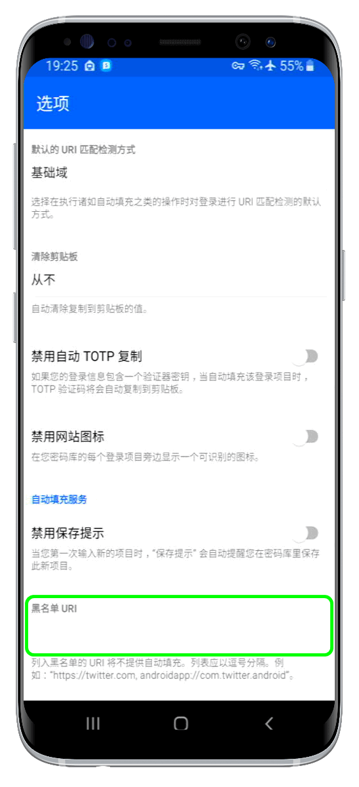

# URI 黑名单


对应的[官方文档地址](https://bitwarden.com/help/article/blacklisting-uris/)



当前，URI 黑名单仅适用于 **Android 8.0（Oreo）**或更高版本上的 Bitwarden 移动端。


自动填充依赖于登录项目的 URI 属性。如果您不熟悉 URI，请阅读 [URI 的使用](using-uris.md)一文。Android 用户可以明确地将 URI 列入黑名单，以防止 Bitwarden 向其提供自动填充功能。要将 URI 列入黑名单，请执行以下操作：

1、在 Bitwarden Android 应用程序中，打开 **⚙️设置**标签页。

2、点击**选项**。

3、向下滚动到选项界面的底部然后在 **URI 黑名单**输入框中输入 URI：



列入黑名单的 URI 应指定为以逗号分隔的指定，例如：

```url
https://twitter.com,androidapp://com.twitter.android,https://facebook.com
```

4、此界面没有**保存**按钮，因此只需按后退按钮或返回上一个界面即可保存您的输入结果。

## Android 应用程序 URI <a href="#android-app-uris" id="android-app-uris"></a>

对于通过网络浏览器访问的网站，正确的 URI 是登录页面的 `https://..` 地址，例如 `https://twitter.com` 或 `https://twitter.com/login`。

**对于 Android 应用程序**，[URI 方案](using-uris.md#uri-schemes)总是以 `androidapp://` 作为开头，这与典型的网络浏览器 URI 有些不一样。例如：

* Twitter Android 应用程序的 URI 为 `androidapp://com.twitter.android`。
* Reddit Android 应用的 URI 为 `androidapp://com.reddit.frontpage`。
* Bitwarden Android 应用程序的 URI 为 `androidapp://com.x8bit.bitwarden`。


为 Android 应用程序获取正确的 URI 的一种简单方法是访问 Google Play 商店中的应用程序页面，点击共享按钮，然后将复制的链接粘贴到您方便阅读的地方。此链接看起来类似于 `https://play.google.com/store/apps/details?id=com.twitter.android`，`id=` 之后的值就是您的 URI，在本示例中为 `com.twitter.android`。

