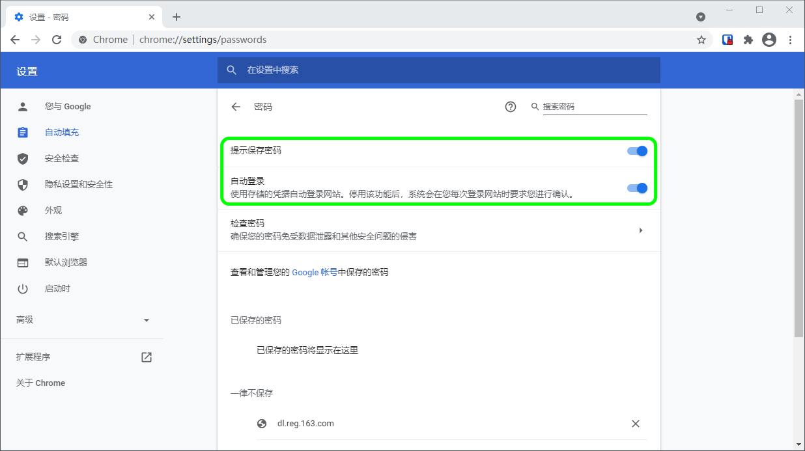
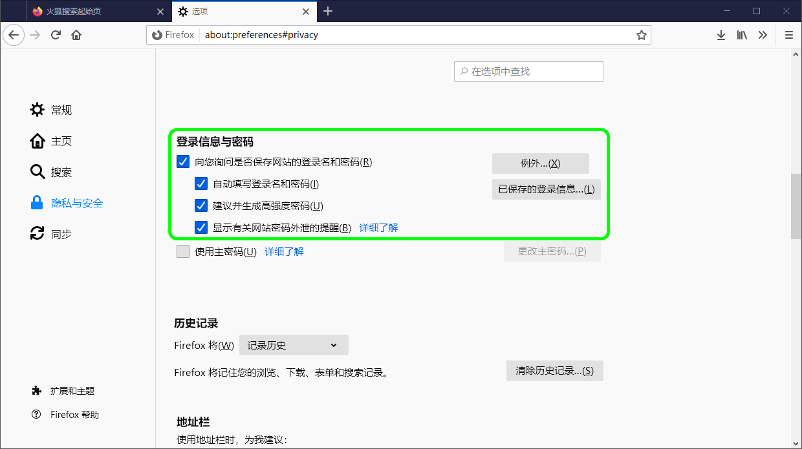

# 禁用浏览器的内置密码管理器


对应的[官方文档地址](https://bitwarden.com/help/article/disable-browser-autofill/)


如果您是 Bitwarden 的新手，很可能您使用的网页浏览器一直在保存和自动填充你的密码。大多数网页浏览器默认启用了这一功能，但专家们普遍认为，内置的密码管理器比 Bitwarden 这样的专业解决方案要脆弱。

鉴于这个原因，并且由于一个活动的内置密码管理器可能会干扰您的 Bitwarden 体验，我们建议禁用网页浏览器的内置密码管理器。

了解如何禁用主流浏览器的内置密码管理器：


很多流行的浏览器，包括 Edge、Opera 和 Brave，都使用一个被称为「Chromium」的谷歌 Chrome 框架。如果您正在使用这些浏览器之一，请参考 **Chrome/Chromium** 部分的说明。




在 Chrome 浏览器或任何基于 Chromium 的浏览器（如 Edge、Opera、Brave）的地址栏中输入  `chrome://settings/passwords`（将 `chrome` 替换为浏览器名称（例如 `brave://settings/passwords`））导航到**密码**页面。

在这个页面上，切换**提示保存密码**选项和**自动登录**选项开关为关闭状态：

此页面还将列出被浏览器存储的所有**已保存的密码**：

如果你还没有将这些密码保存到 Bitwarden 中，请[将它们导出](../import-export/import-guides/import-your-data-from-google-chrome.md#export-from-chrome)，为将来导入 Bitwarden 做准备。导出后，你应该从浏览器的存储中删除这些密码。



在 Firefox 中，导航到**选项** → **隐私和安全**，然后向下滚动到**登录信息与密码**部分。在此部分，取消勾选所有预先勾选的选项：

您还可以通过选择**已保存的登录信息...** 按钮来了解 Firefox 已经保存了哪些登录信息：

如果你还没有将这些密码保存到 Bitwarden 中，请[将它们导出](../import-export/import-guides/import-your-data-from-firefox.md)，以便将来导入 Bitwarden。导出后，你应该从 Firefox 中 **🗑️移除**这些密码。



在 Safari 中，从菜单栏打开**偏好**，然后导航到**自动填充**选项卡。在这个选项卡上，取消勾选所有预先勾选的选项：


Safari 密码选项


您还可以通过浏览**密码**选项卡来了解 Safari 已经保存了哪些密码：


Safari 已保存的密码


如果您还没有将这些密码保存到 Bitwarden 中，请在 Bitwarden 中为这些密码创建登录项目。所有密码都保存到 Bitwarden 中后，从 Safari 中**移除**这些密码。



在 Vivaldi 中，打开 **⚙️Vivaldi 设置**窗口，从左侧导航中选择 **👁‍🗨隐私**。向下滚动到密码部分并取消选中**保存网页密码**选项：

你还可以通过选择**显示已保存的密码**按钮来了解 Vivaldi 已经保存了哪些密码：

如果您还没有将这些密码保存到 Bitwarden 中，请在 Bitwarden 中为这些密码创建登录项目。所有密码都保存到 Bitwarden 中后，通过右键单击每个密码并选择**删除密码**，以从 Vivaldi 中移除这些密码。



虽然 Tor 与 Firefox 共享同一来源，但 Tor 是独立的，它默认不保存您的登录信息。如果你没有手动配置过 Tor 来保存和自动填充登录信息，那么就准备好了。

如果你设置了，在地址栏中输入 `about:preferences#privacy` 导航到**密码**页面，并向下滚动到登录和密码部分。取消勾选所有您已勾选的选项：

你还可以通过选择**已保存的登录信息...** 按钮来了解 Tor 已经保存了哪些登录信息：

如果您还没有将这些密码保存到 Bitwarden 中，请在 Bitwarden 中为这些密码创建登录项目。所有密码都保存到 Bitwarden 中后，从 Tor 中**移除**这些密码。


