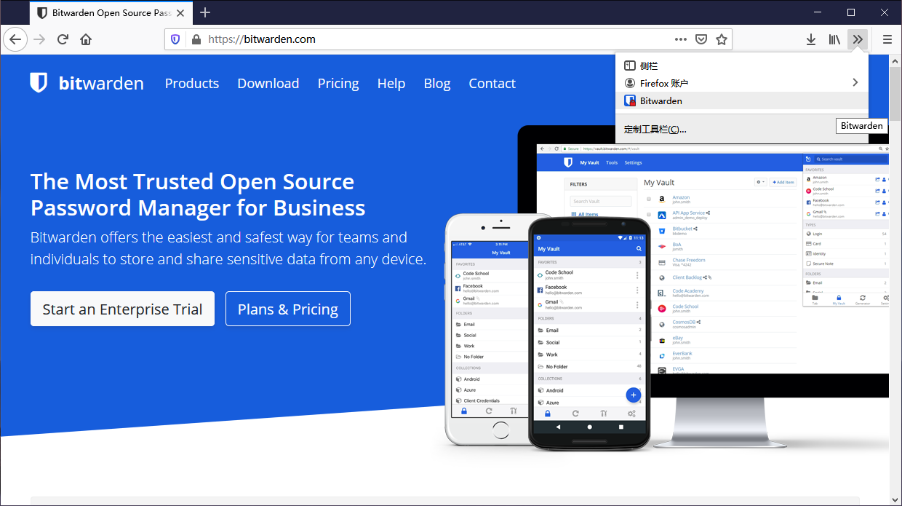

# 浏览器扩展入门


对应的[官方文档地址](https://bitwarden.com/help/article/getting-started-browserext/)


Bitwarden 浏览器扩展将密码管理直接集成到您最喜爱的浏览器中。从您的浏览器市场或应用商店，或从 [Bitwarden 下载](https://bitwarden.com/download)页面下载 Bitwarden 浏览器扩展。

浏览器扩展支持 **Google Chrome**、**Mozilla Firefox**、**Opera**、**Microsoft Edge** 和 **Safari** 的最近两个版本。对于 **Vivaldi**、**Brave** 和 **Tor**，只支持最新的版本。


Safari 浏览器扩展与桌面应用程序打包在一起，其可从 App Store 下载。[了解更多](../miscellaneous/safari-web-extension.md)。



Google Chrome 中的 Bitwarden 浏览器扩展


## 第一步 

让我们通过将一个新的登录项目添加到您的密码库并确保其安全且易于查找来开始您的 Bitwarden 浏览器扩展之旅：

### 创建一个文件夹 

[文件夹](../your-vault/folders.md)是确保您在需要使用时始终可以找到密码库项目的好方法。要创建一个文件夹：

1. 选择 **⚙️设置**选项卡，然后从设置列表中选择**文件夹**。
2. 选择 **🞤添加**图标。
3. 给您的新文件夹起个名字（例如 `Social Media`），然后选择**保存**。

### 添加一个登录项目 

现在，让我们添加一个登录项目到您的新文件夹中。要创建新的登录项目：

1. 导航到 **🔒我的密码库**选项卡，然后选择 **🞤添加**图标。
2. 选择要添加的项目的类型（这里我们选择**登录**）。
3. 输入这个新项目的基本信息：
   * 帮助您轻松识别它的**名称**（例如 `Twitter Account`）
   * 您的**用户名**。
   * 您的当前**密码**（我们待会会用一个强大的密码来替换它）。
4. 在 **URI 1** 字段中，输入您登录帐户的 URL（例如 `https://twitter.com/login`）。
5. 从文件夹下拉列表中选择一个**文件夹**，如果您按照我们的示例进行操作，请选择我们刚刚创建的 **Social Media** 文件夹！
6. 很好！选择**保存**以继续。

### 生成一个强密码 

现在，您已经保存了一个新的登录项目，让我们使用一个强密码替换您的密码来提高它的安全性：

1、在您的网页浏览器中，使用您现有的用户名和密码登录到此帐户。在账户中，找到**更改密码**页面。

2、在**更改密码**页面，输入您的**当前密码**，您可以从 Bitwarden 使用 **❐复制**图标来复制并粘贴该密码。

3、返回到 Bitwarden，选择此登录项目然后选择**编辑**按钮**️**。

4、在密码框中，选择 **⟳生成**然后选择**确认**以覆盖您的旧密码。这将使用随机生成的强密码替换您的密码。从 `Fido1234` 更改为 `X@Ln@x9J@&u@5n##B` 可以阻止潜在的黑客攻击。

5、选择**保存**。

6、复制您的新密码并将其粘贴到网站上的**新密码**和**确认密码**字段中。

恭喜！您的登录项目现已安全且易于使用地保存在 Bitwarden 中了！


您在登录时看到此横幅了吗？

.png>)

如果 Bitwarden 检测到登录信息尚未保存在您的密码库中，它将提示记住登录信息。当您看到此横幅时，选择**是，立即保存**以新增一个包含用户名、密码和 URI 的登录项目。您还可以使用**选择文件夹...** 下拉菜单来选择将其放入的文件夹。

如果您不想看到此横幅，请从**选项**菜单中关闭**询问添加登录**选项。


## 下一步 

现在您已经掌握了基础知识，让我们深入了解您将经常使用的更多操作，**自动填充**和三个推荐的设置步骤，更轻松地**解锁**密码库，将扩展**固定**到浏览器，以及**禁用浏览器内置**的密码管理器：

### 自动填充登录信息 

Bitwarden 浏览器扩展有一个独特的**标签页**视图，它可以自动检测已打开的标签页中显示的网页的 URI（例如 `google.com`），并浮现所有具有相应 URI 的密码库项目。

当一个密码库项目有对应的 URI 时，Bitwarden 图标将覆盖一个气泡通知，报告该网页对应的密码库项目的数量：


浏览器扩展自动填充


只要简单地点击浏览器扩展中的密码库项目，就会自动将登录信息填入检测到的输入字段中。

浏览器扩展项有好几种可供选择的自动填充选项，包括上下文菜单和键盘快捷键。[了解更多](../auto-fill/auto-fill-logins-in-browser-extensions.md)。

### 使用 PIN 码/生物识别解锁 

要快速访问您的凭证，请设置 PIN 码或生物识别来解锁您的密码库。要设置一个 PIN 码。

1. 在浏览器扩展中，打开 ⚙️**设置**标签。
2. 在安全部分，选中**使用 PIN 码解锁**复选框。
3. 在输入框中输入所需的 PIN 码。PIN 码可以是任意字符（a-z、0-9、$、＃ 等）的组合。


**可选**：预先选中的**浏览器重启时使用主密码锁定**选项将要求您在浏览器重新启动时输入主密码而不是 PIN 码。如果您希望能够在浏览器重新启动时使用 PIN 码解锁，请取消选中此选项。


### 固定扩展 

固定浏览器扩展程序可确保每次打开浏览器时都可以轻松访问它。根据您使用的浏览器，此过程有所不同：



选择地址栏右侧的**扩展程序**图标，然后在扩展程序列表中选择 Bitwarden 旁边的**固定**图标：




在地址栏中输入`about:addons`，然后打开 Bitwarden 扩展。要自定义它在浏览器中的显示_位置_，右键单击 Bitwarden  浏览器扩展图标，然后选择**定制...** 打开一个拖放界面，以让你移动或移除工具栏中的图标。你也可以使用**固定到折叠菜单**选项，将 Bitwarden 固定到折叠（ **»**）菜单中：




右键单击工具栏中的任意位置，然后选择**自定义工具栏**打开一个拖放界面，以让你移动或移除工具栏中的图标：


Safari 中的 Pin




### 禁用内置的密码管理器 

大多数网络浏览器默认会自动保存您的密码，但专业人士普遍认为，相比 Bitwarden 等专用解决方案，[内置的密码管理器更容易受到攻击](https://www.wired.com/2016/08/browser-password-manager-probably-isnt-enough/)：



在 Chrome 或任何基于 Chromium 的浏览器（Edge、Opera 和 Brave）中，通过在地址栏中输入 `chrome://settings/passwords` 以导航到密码页面，将 `chrome` 替换为您的浏览器的名称（例如，`brave://settings/passwords`）。

在此页面上，同时关闭**自动保存密码**选项和**自动登录**选项：

{% embed url="https://bitwarden.com/_gatsby/image/bec8466895c6cdf57c5889bc093fe6e2/ff2e3f564e55864b4efc8ba345d4781b/chrome-disable-autofill.webp?u=https%3A%2F%2Fimages.ctfassets.net%2F7rncvj1f8mw7%2F6bpi4fkyZhnkhW5RBtugDW%2Fd8e2de4536d6a34f092fd9d5975fd04a%2Fchrome-disable-autofill.png&a=w%3D850%26h%3D339%26fm%3Dwebp%26q%3D75&cd=2022-01-19T18%3A22%3A30.687Z" %}
Chrome 浏览器选项


此页面还将列出浏览器存储的所有**已保存的密码**：

{% embed url="https://bitwarden.com/_gatsby/image/f0a41442bf670e994ef31452099de52b/02bdd03f039f7e37de7bcadbdbdbd89b/chrome-delete-passwords.webp?u=https%3A%2F%2Fimages.ctfassets.net%2F7rncvj1f8mw7%2F4P5alfndwwNgCpTYrSCg61%2Fb3545839a8429f28ee7b6ac66559c3ce%2Fchrome-delete-passwords.png&a=w%3D850%26h%3D299%26fm%3Dwebp%26q%3D75&cd=2022-01-19T18%3A22%3A30.693Z" %}
Chrome 已保存的密码


如果您尚未在 Bitwarden 中保存这些密码，请[将它们导出](../import-export/import-guides/import-your-data-from-google-chrome.md#export-from-chrome)以准备将来导入到 Bitwarden。导出后，您应该从浏览器的存储中删除这些密码。



在 Firefox 中，导航到**首选项** → **隐私与安全**，然后向下滚动到**登录信息与密码**部分。在这部分中，取消选中所有预先选中的选项：

{% embed url="https://bitwarden.com/_gatsby/image/0341d97906f3865c48152c0db53cbfb0/4a3b074f7313bbd147643d2e3ce31d09/firefox-disable.webp?u=https%3A%2F%2Fimages.ctfassets.net%2F7rncvj1f8mw7%2F72yK5CCMKa9pcfCcdvUZqL%2F43842f5ab8ed69f16b05513ed16fe864%2Ffirefox-disable.png&a=w%3D850%26h%3D379%26fm%3Dwebp%26q%3D75&cd=2022-01-19T18%3A22%3A30.752Z" %}
Firefox 密码选项


您还可以通过选择**已保存的登录信息...** 按钮找出 Firefox 已经保存了哪些登录信息：

{% embed url="https://bitwarden.com/_gatsby/image/1bba46aad2566d8c3b4950078cb6c2b3/4a3b074f7313bbd147643d2e3ce31d09/firefox-delete.webp?u=https%3A%2F%2Fimages.ctfassets.net%2F7rncvj1f8mw7%2F5UrQ6bGCjV0VdHvy6rzece%2F576d7d25e03348dee8f06a9af5badb25%2Ffirefox-delete.png&a=w%3D850%26h%3D379%26fm%3Dwebp%26q%3D75&cd=2022-01-19T18%3A22%3A30.687Z" %}
Firefox 已经保存的登录信息


如果您尚未在 Bitwarden 中保存这些密码，请[将它们导出](../import-export/import-guides/import-your-data-from-google-chrome.md#export-from-chrome)以准备将来导入到 Bitwarden。导出后，您应该从 Firefox 中**移除**这些密码。



在 Safari 中，从菜单栏中打开**首选项**然后导航到**自动填充**选项卡。在此选项卡上，取消选中所有预先选中的选项：

{% embed url="https://bitwarden.com/_gatsby/image/5bf928b2f97577c49055c93909bbb42c/892d190c49271c85d8019df6cee053c3/safari-disable.webp?u=https%3A%2F%2Fimages.ctfassets.net%2F7rncvj1f8mw7%2F4nuEz911vsIAUegHVL0Zec%2F7d663935c4f9e65297c14598f1037b72%2Fsafari-disable.png&a=w%3D850%26h%3D425%26fm%3Dwebp%26q%3D75&cd=2022-01-19T18%3A15%3A58.390Z" %}
Safari 密码选项


您还可以通过导航到**密码**选项卡找出 Safari 已经保存了哪些密码：

{% embed url="https://bitwarden.com/_gatsby/image/9dbe139d36f69f5320bfb0f2b893fff9/b0a95e30dca9e0b43e12c10499df5e09/safari-delete.webp?u=https%3A%2F%2Fimages.ctfassets.net%2F7rncvj1f8mw7%2F6eZMZC98Grc7sbdHbBfXtK%2F4c72d19c26e56ad7dfb3267f466bd119%2Fsafari-delete.png&a=w%3D850%26h%3D621%26fm%3Dwebp%26q%3D75&cd=2022-01-19T18%3A15%3A58.390Z" %}
Safari 已保存的密码


如果您尚未在 Bitwarden 中保存这些密码，请在 Bitwarden 中为这些密码创建登录项目。所有已保存的密码都保存到 Bitwarden 中后，请从 Safari 中**移除**这些密码。



在 Vivaldi 中，打开 **⚙️Vivaldi 设置**窗口，然后从左侧导航中选择 **👁‍🗨隐私**。向下滚动到密码部分并取消选中**保存网页密码**选项：

{% embed url="https://bitwarden.com/_gatsby/image/78b1623b1cbab2c7f237dfb8d21c545a/e6e4fa4772e717496252877322331d72/vivaldi-disable.webp?u=https%3A%2F%2Fimages.ctfassets.net%2F7rncvj1f8mw7%2F6nk9FVDeg8XaUz22Xahr8T%2Fee0f597cc264da5a30853588d541f074%2Fvivaldi-disable.png&a=w%3D850%26h%3D411%26fm%3Dwebp%26q%3D75&cd=2022-01-19T18%3A15%3A58.396Z" %}
Vivaldi 密码选项


您还可以通过选择**显示已保存的密码**按钮找出 Vivaldi 已经保存了哪些密码：

{% embed url="https://bitwarden.com/_gatsby/image/58891ea82fd0aa4023a48db343d9e5b5/880784a713e5346ee292517901892eb4/vivaldi-delete.webp?u=https%3A%2F%2Fimages.ctfassets.net%2F7rncvj1f8mw7%2F1j5qvcTAVsXficByKFewec%2Ffd6f86731a9e15d38e0cbc39f4f64197%2Fvivaldi-delete.png&a=w%3D756%26h%3D263%26fm%3Dwebp%26q%3D75&cd=2022-01-19T18%3A15%3A58.382Z" %}
Vivaldi 已保存的密码


如果您尚未在 Bitwarden 中保存这些密码，请在 Bitwarden 中为这些密码创建登录项目。所有已保存的密码都保存到 Bitwarden 中后，通过右键单击每个密码并选择**删除密码**从 Vivaldi 中删除这些密码。



虽然 Tor 与 Firefox 共享根目录，但 Tor 的独特之处在于默认情况下它不会保存您的登录信息。如果您还没有手动配置 Tor 来保存和自动填充登录信息，那么您已经准备好了。

如果您配置过了，请通过在地址栏中输入 `about:preferences#privacy` 导航到**密码**页面，然后向下滚动到登录和密码部分。关闭您勾选过的所有选项：

{% embed url="https://bitwarden.com/_gatsby/image/2491c33c8a021be60933dfcf36ce463e/9dfed6e43dcce5bd724dfb6bf4af0789/tor-disable.webp?u=https%3A%2F%2Fimages.ctfassets.net%2F7rncvj1f8mw7%2F4FcJnbhCUhDNITJjiy9ciD%2Fd0f83af69188afaf619788c7e60c9a1b%2Ftor-disable.png&a=w%3D850%26h%3D505%26fm%3Dwebp%26q%3D75&cd=2022-01-19T18%3A15%3A57.376Z" %}
Tor 密码选项


您还可以通过选择**已保存的登录信息...** 按钮找出 Tor 已经保存了哪些登录信息：

{% embed url="https://bitwarden.com/_gatsby/image/469e117604582f5fa838f9a8a135d4b0/aa7a7bd527502fe311a7f50119e50a6c/tor-delete.webp?u=https%3A%2F%2Fimages.ctfassets.net%2F7rncvj1f8mw7%2F3NHOIo5RIwTjVecqRPeT5Y%2F6c1e26dc5385006a498b77c48e1048c2%2Ftor-delete.png&a=w%3D850%26h%3D490%26fm%3Dwebp%26q%3D75&cd=2022-01-19T18%3A15%3A57.375Z" %}
Tor 已保存的密码


如果您尚未在 Bitwarden 中保存这些密码，请在 Bitwarden 中为这些密码创建登录项目。所有密码都保存到 Bitwarden 中后，从 Tor 中 **🗑️移除**这些密码。


