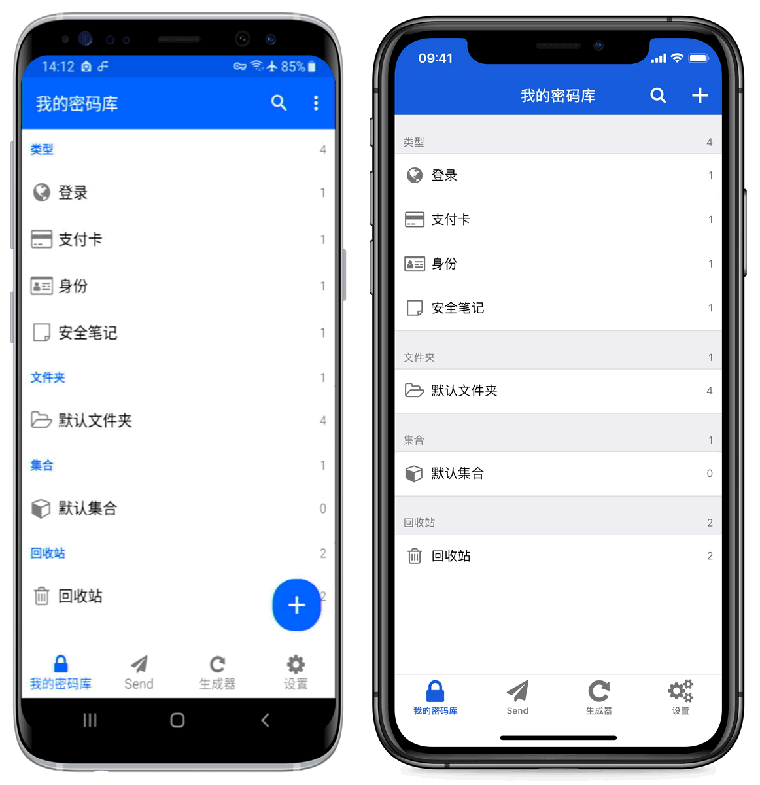
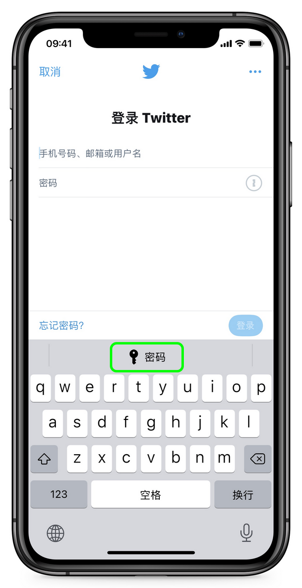

# 移动应用程序入门


对应的[官方文档地址](https://bitwarden.com/help/article/getting-started-mobile/)


Bitwarden 的移动应用程序让你可以随身携带你的密码管理器。从 App Store 或 Google Play Store，或在您的设备上访问 [get.bitwarden.com](https://get.bitwarden.com/) 以载 Bitwarden。

## 第一步 

让我们通过将一个新的登录项目添加到您的密码库并确保其安全且易于查找来开始您的 Bitwarden 移动应用程序之旅：

### 创建一个文件夹 

文件夹是确保您在需要使用时始终可以找到密码库项目的好方法。要创建一个文件夹：

1. 选择 **⚙️设置**选项卡，然后从设置列表中选择**文件夹**。
2. 选择 ✚**添加**图标。
3. 给您的新文件夹起个名字（例如 `Social Media`），然后选择**保存**。

### 添加一个登录项目 

现在，让我们添加一个登录项目到您的新文件夹中。要创建新的登录项目：

1. 导航到 **🔒我的密码库**选项卡，然后选择 ✚**添加**图标。
2. 选择要添加的项目的类型（这里我们选择**登录**）。
3. 输入这个新项目的基本信息：
   * 帮助您轻松识别它的**名称**（例如 `Twitter Account`）
   * 您的**用户名**。
   * 您的当前**密码**（我们待会会用一个强大的替换它）。
4. 选择 ✚**新建 URI** 按钮，然后输入您登录账户的 URL（例如 `https://twitter.com/login`）。
5. 从文件夹下拉列表中选择一个**文件夹**，如果您按照我们的示例进行操作，请选择我们刚刚创建的 **Social Media** 文件夹！
6. 很好！选择**保存**以继续。

### 生成一个强密码 

现在，您已经保存了一个新的登录项目，让我们使用一个强密码替换您的密码来提高它的安全性：

1、打开网页浏览器或移动应用程序，然后使用您现有的用户名和密码登录您的账户。登陆后，找到**更改密码**页面。

2、在**更改密码**页面，输入您的**当前密码**，您可以从 Bitwarden 复制并粘贴该密码。

3、返回到 Bitwarden，选择登录项目然后在 iOS 上点击**编辑**或在 Android 上点击 **✏️**。

4、在密码框中，选择 **⟳生成**然后**确认**以覆盖您的旧密码。

这将使用随机生成的强密码替换您的密码。从 `Fido1234` 更改为 `X@Ln@x9J@&u@5n##B` 可以阻止潜在的黑客攻击。

5、选择**保存**。

6、复制您的新密码并将其粘贴到另一个应用程序的**新密码**和**确认密码**字段中。

恭喜！您的登录项目现已安全且易于使用地保存在 Bitwarden 中了！

### 添加第二个账户 

您是否有多个 Bitwarden 账户？例如一个用于个人使用，一个用于工作。桌面应用程序可以一次性同时登录 5 个账户！

要登录第二个账户，请从桌面应用程序的右上角选择当前已登录的账户，然后选择 ✚**添加账户**：


移动端账户


登录第二个账户后，您可以从同一菜单中快速切换它们，该菜单还将显示每一个账户的密码库的当前状态（_已锁定_或_已解锁_）。如果您注销其中一个账户，它将从此列表中移除。

## 下一步 

现在您已经掌握了基础知识，让我们深入了解 Bitwarden 移动应用程序的一些更强大的功能：



### 设置自动填充 

设置自动填充以从您的 Android 设备自动输入登录信息到网页浏览器（如 Chrome）或其他应用程序中。

1. 在您的 Android Bitwarden 应用程序中，点击屏幕底部的 **⚙️设置**选项卡。\
   根据所你使用的 Android 版本，会列出一些自动填充选项。
2. 点击您可用的自动填充选项，并将其开启。绿色的`已启用`信息表明自动填充处于活动状态。\
   切换后，您可能需要根据您可用的或已启用的自动填充选项来更改某些 Android 本地设置。有关更多信息，请参阅 [Android 上的自动填充登录](../password-manager/auto-fill/auto-fill-basics/auto-fill-logins-on-android.md)。

### 从移动应用程序启动 

你可以直接从 Bitwarden 移动应用程序启动一个网站，方法是在任何具有有效 URI 的密码库项目中选择 **⮫启动**按钮。如果你不熟悉 URI 的使用，请参阅 [URI 的使用](../auto-fill/using-uris.md)。


从移动端启动


### 使用生物识别解锁 

用生物识别技术解锁 Bitwarden，可以无缝访问你的密码库。如果你还没有在 Android 设备上设置[指纹解锁](https://support.google.com/nexus/answer/6285273?hl=en)或[面部解锁](https://support.google.com/pixelphone/answer/9517039?hl=en)，你需要通过 Android 的 **⚙️设置**应用进行设置。

1. 在你的 Android Bitwarden 应用程序中，点击屏幕底部的 **⚙️设置**选项卡。
2. 根据你的设备的可用功能，点击：
   * **使用指纹解锁**
   * **使用面部 ID 解锁**
3. 根据您的选择，将要求您用指纹或面部进行验证。绿色的`已启用`标签将表示此选项处于激活状态。

启用后，您就可以使用您刚选择的生物识别方式来打开您的 Bitwarden 应用程序，或者自动填写登录信息。

### 使用自动填充登录 

当您已经设置了[自动填充](getting-started-mobile.md#setup-auto-fill)和[生物识别](getting-started-mobile.md#unlock-with-biometrics)，使用 Bitwarden 登录应用程序或网站就变得很简单了。

1、点击应用程序或网站中的电子邮件/用户名或密码输入框。

2、根据您的设备使用的自动填充选项，点击可用的叠加层：


Android 自动填充种类


3、将提示验证你的面部 ID 或指纹。如果你未使用[生物识别](getting-started-mobile.md#unlock-with-biometrics)，请输入你的主密码。

4、如果您已经使用 [URI 字段](getting-started-mobile.md#create-new-items)为此网站或应用程序链接了一个登录，该登录将出现在此窗口中。如果没有，请点击 **🔍搜索**来查找。

点击此登录项目，会自动将你的电子邮件/用户名和密码输入框中并登录！



### 设置自动填充 

设置自动填充以从您的 iOS 设备自动输入登录信息到网页浏览器（如 Chrome）或其他应用程序中。

1. 在 iOS 的 Home 界面，点击 **⚙️设置**应用程序。
2. 在设置菜单中，点击**密码**。
3. 点击**自动填充密码**。
4. 点击**自动填充密码**开关。绿色表示自动填充处于激活状态。
5. 在**允许的填充来源**列表中，选择 **Bitwarden**。复选标记（**✔**）表示已选择 Bitwarden。

创建新的登录时，请确保在 [URI 字段](getting-started-mobile.md#add-a-login)中输入网站地址以将其用于自动填充。

### 从移动应用程序启动 

你可以直接从 Bitwarden 移动应用程序启动一个网站，方法是在任何具有有效 URI 的密码库项目中选择 **⮫启动**按钮。如果你不熟悉 URI 的使用，请参阅 [URI 的使用](../auto-fill/using-uris.md)。


从移动端启动


### 使用生物识别解锁 

用生物识别技术解锁 Bitwarden，可以无缝访问你的密码库。如果你还没有在 iOS 设备上设置触控 ID 和面容 ID，需要先通过 iOS 的 **⚙️设置**应用进行设置。

1. 在你的 iOS Bitwarden 应用程序中，点击屏幕底部的 **⚙️设置**标签。
2. 根据你的设备的可用功能，点击：
   * **使用触控 ID 解锁**
   * **使用面容 ID 解锁**
3. 根据您的选择，将要求您使用指纹或面部进行验证。绿色的`已启用`标签将表示此选项处于激活状态。

启用后，您就可以使用您刚选择的生物识别方式来打开您的 Bitwarden 应用程序，或者自动填充登录信息。

### 使用自动填充登录 

当您已经设置了[自动填充](https://help.bitwarden.in/getting-started/get-started-with-mobile-apps#setup-auto-fill-1)和[生物识别](https://help.bitwarden.in/getting-started/get-started-with-mobile-apps#unlock-with-biometrics-1)，使用 Bitwarden 登录应用程序或网站就变得很简单了。

1、点击应用程序或网站中的电子邮件/用户名或密码输入框。

2、在您的键盘上方，点击**密码**： &#x20;

3、将提示验证你的面容 ID 或触控 ID。如果你未使用[生物识别](https://help.bitwarden.in/getting-started/get-started-with-mobile-apps#unlock-with-biometrics-1)，请输入你的主密码。

4、如果您已经使用 [URI 字段](https://help.bitwarden.in/getting-started/get-started-with-mobile-apps#create-new-items-1)为此网站或应用程序链接了一个登录，该登录将出现在此窗口中。如果没有，请点击 **🔍搜索**来查找。点击此登录项目，会自动将你的电子邮件/用户名和密码输入框中并登录！


