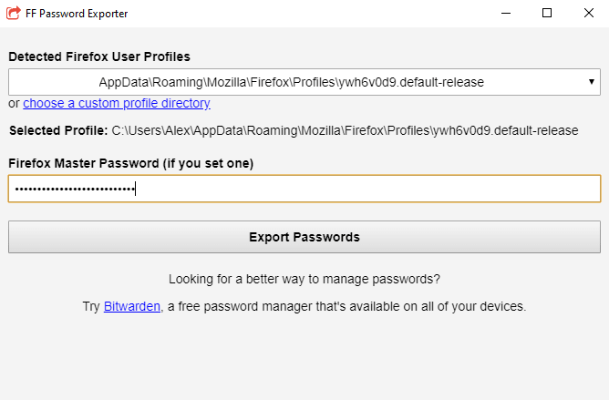

# 从 Firefox 导入数据


对应的[官方文档地址](https://bitwarden.com/help/article/import-from-firefox/)


使用这篇文章帮助您从 Firefox 导出数据并将其导入 Bitwarden 中。

## 从 Firefox 导出 <a href="#export-from-firefox" id="export-from-firefox"></a>

从 Firefox 导出可能会有所不同，具体取决于您所使用的版本，或者如果您使用的是基于 Firefox 的浏览器（例如 Tor 浏览器或 Waterfox）：



要从最新版 Firefox 导出您的登录信息：

1、使用地址栏导航到 `about:logins`。

2、选择右上方的 **⋯** 菜单按钮，并从下拉列表中选择**导出登录信息...**。

将提示您指定一个位置来保存导出的登录信息。

Firefox 将登录信息导出为 `.csv` 文件。



某些旧版本的 Firefox 不支持本地导出。完成以下步骤以使用 FF Password Exporter 导出：

1、[下载](https://github.com/kspearrin/ff-password-exporter)，安装然后打开 FF Password Exporter。

2、从检测到的 Firefox 用户配置中或从指定的自定义配置目录中，选择一个用户配置。如果您为用户配置设置了主密码，请输入该密码。



3、选择**导出密码**按钮。

4、选择 `.csv` 文件格式，并将文件保存到设备中。



某些基于 Firefox 的浏览器提供了不同于 vanilla Firefox 的登录导出位置。如果从**最新版本**导出不成功，请尝试以下方法：

1、使用地址栏导航到 `about:preferences#privacy`。

2、点击**保存登录信息**按钮。

3、选择右上方的 **⋯** 菜单按钮，并从下拉列表中选择**导出登录信息**。

将提示您指定一个位置来保存导出的登录信息。

大多数基于 Firefox 的浏览器将登录信息导出为 `.csv` 文件。



## 导入 Bitwarden <a href="#import-to-bitwarden" id="import-to-bitwarden"></a>


**数据必须从网页密码库或 CLI 导入到 Bitwarden**。数据在发送到服务器存储之前会在本地进行[加密](../../security/encryption.md)。



要导入数据到您的密码库：

1、通过 [https://vault.bitwarden.com](https://vault.bitwarden.com) 或自托管的 `https://your.bitwarden.domain.com` 登录到网页密码库。

2、从顶部导航条选择**工具**。

3、从工具菜单选择**导入数据**。

4、从格式下拉菜单，选择一个[文件格式](../import-and-export-faqs.md#q-what-file-formats-does-bitwarden-support-for-import) 。

5、选择**选择文件**按钮并添加一个文件用于导入，或将文件内容**复制/粘贴**到输入框中。


导入时不会检查要导入的文件中的项目是否已存在于您的密码库中，因此**多次导入文件或导入具有已存在于密码库中的项目的文件将创建重复项目**。


6、选择**导入数据**按钮以开始导入。

7、成功导入后，从您的计算机中将导入源文件删除。这将在您的计算机受到威胁时为您提供保护。

[文件附件](../../your-vault/file-attachments.md)需要手动上传到您的密码库。



要从 CLI 将数据导入您的密码库，请使用以下命令：

```shell
bw import <format> <path>
```

`bw import` 命令需要格式（使用 `bw import --formats` 获取格式列表）和路径，例如：

```shell
bw import lastpasscsv /Users/myaccount/Documents/mydata.csv
```

成功导入后，从您的计算机中将导入源文件删除。这将在您的计算机受到威胁时为您提供保护。


