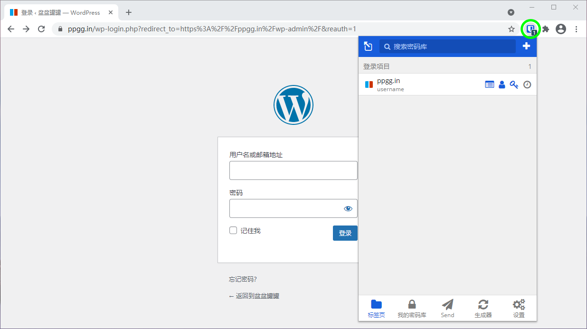

# 浏览器扩展中的自动填充登录


对应的[官方文档地址](https://bitwarden.com/help/article/auto-fill-browser/)



如果您的浏览器扩展在自动填充特定站点的用户名和密码时遇到问题，使用[已链接的自定义字段](<Auto-fill Custom Fields.md#using-linked-custom-fields>)可以强制自动填充。

此外，基本验证提示的工作方式与常规自动填充略有不同。有关更多信息，请参阅另一篇[基本验证提示](../../../auto-fill/basic-auth-prompts.md)的文章。


Bitwarden 浏览器扩展有一个独特的**标签页**视图，它可以自动检测打开的标签页中显示的网页的 URI（例如 `myturbotax.intuit.com`），并浮现所有具有相应 URI 的密码库项目。如果您不熟悉 URI 的使用，我们建议您阅读[此文](../../../auto-fill/using-uris.md)。

当一个密码库项目有对应的 URI 时，Bitwarden 图标将覆盖一个角标计数器，报告该网页所对应的密码库项目的数量（_如下图_）。


如果需要，您可以使用 ⚙️**设置** → **选项**菜单中的切换开关来禁用角标计数器。


选择**标签页**视图中的密码库项目，即可将登录信息自动填入检测到的输入字段中。如果一个网页或服务具有**多个**关联 URI 的登录项目，Bitwarden 将始终自动填充上次使用的登录项目。

## 使用上下文菜单 


此功能目前在 Safari 浏览器扩展程序中不可用。


在不打开浏览器扩展程序的情况下，您可以在用户名或密码输入栏上点击右键，然后使用 **Bitwarden** → **自动填充**选项。当您尝试此操作时，如果您的密码库已锁定，则会打开一个新的标签页，提示您解锁。解锁后，浏览器扩展将自动继续填充您的凭据。

## 使用键盘快捷键 

Bitwarden 浏览器扩展提供了一组键盘快捷键（又称为_热键_）来自动填充登录信息。当您尝试此操作时，如果您的密码库已锁定，则会打开一个新的标签页，提示您解锁。解锁后，浏览器扩展将自动继续填充您的凭据。

要自动填充登录信息，请使用以下**默认**快捷键。如果检测到的 URI 匹配多个项目，最后使用的登录项目将用于自动填充操作。您可以通过反复使用键盘快捷键来循环浏览多个登录项目：

* Windows：`Ctrl + Shift + L`
* macOS：`Cmd + Shift + L`
* Linux：`Ctrl + Shift + L`


如果登录使用 [Bitwarden 验证器 TOTP](../../../your-vault/totp.md)，使用 `Cmd/Ctrl+Shift+L` 在自动填充后会自动将你的 TOTP 复制到剪贴板。你要做的就是使用 `Cmd/Ctrl+V` 来粘贴！


如果任何已指定的快捷键不能使用，很可能是因为你的设备上的另一个应用程序已经占用了它。例如，Windows 上的自动填充快捷键通常被 AMD Radeon Adrenaline 软件（AMD图形驱动程序）使用，因此不能被 Bitwarden 使用。在这种情况下，您应该释放该快捷键，或者配置 Bitwarden 使用其他快捷键。

### 配置键盘快捷键 

根据你使用的浏览器不同，配置 Bitwarden 浏览器扩展程序使用的键盘快捷键也不同。要访问配置菜单：

* **在 Chrome 中**，在地址栏输入 `chrome://extensions/shortcuts`。在基于 Chromium 的浏览器（如 Brave）中，用 `chrome` 代替相应的浏览器名称（如 `brave://extensions/shortcuts`）。
* **在 Firefox 中**，在地址栏中输入 `about:addons`，选择**管理您的扩展程序**旁边的 **⚙️齿轮**图标，并从下拉菜单中选择**管理扩展程序快捷键**。

某些浏览器包括 **Safari** 和旧版 **Edge**，目前不支持更改扩展程序的默认键盘快捷键。

## 页面加载时自动填充 

页面加载时自动填充是 Bitwarden 浏览器扩展提供的一个**实验性的和可选的**功能。页面加载时自动填充功能将在加载与登录项目的 URI 值对应的网页时自动填充登录信息。启用后，您可以设置其默认的行为（即对所有密码库项目开启或对密码库项目关闭）。

要启用此功能，请导航到浏览器扩展中的**设置** → **选项**，勾选**启用页面加载时自动填充**选项，然后选择默认行为。启用并设置默认行为后，您还可以为每一个单独的密码库项目指定页面加载时的自动填充行为：


页面加载选项


使用此约定，您可以将浏览器扩展设置为，例如：

* 仅针对选定的少数几个项目执行页面加载时自动填充（即对所有密码库项目**默认关闭**，并对选定的项目**手动打开**）。
* 针对除选定的少数几个项目之外的所有项目执行页面加载时自动填充（即对所有密码库项目**默认打开**，并对选定的项目**手动关闭**）。


此功能是**实验性**的，并默认处于禁用状态，因为虽然一般来说是安全的，但拥有虚假网站的攻击者可以利用这一点来窃取凭证。


## 手动自动填充 

您可以手动自动填充没有保存 URI 的项目，方法是在 **🔒我的密码库**视图中打开它，然后选择**自动填充**按钮。

## TOTP 复制 

如果您使用 Bitwarden Authenticator，当登录项目通过上述任何一种方式被自动填充时，Bitwarden 会自动将登录项目的 TOTP 代码复制到剪贴板中。

您可以从浏览器扩展的 **⚙️设置**选项卡中禁用此选项并设置一个清除剪贴板的自定义间隔：


剪贴板设置

