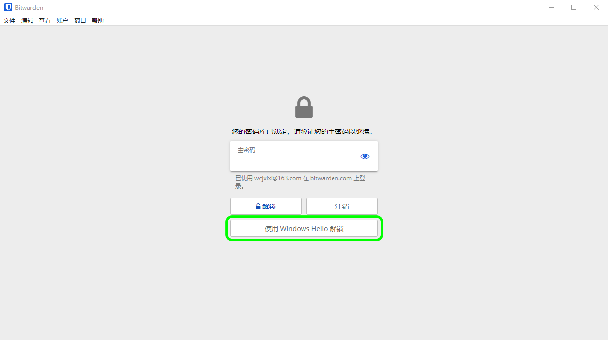

# 使用生物识别解锁


对应的[官方文档地址](https://bitwarden.com/help/article/biometrics/)


Bitwarden 可以被配置为接受生物识别的的方式来解锁您的密码库。

生物识别**只能用于解锁**您的密码库，**登录**时您仍然会被要求使用您的主密码和任何已启用的[两步登录方式](../two-step-login/two-step-login-methods.md)。如果不确定两者之间的区别，请向下滚动至[理解解锁与登录](unlock-with-pin.md#understanding-unlock-vs-log-in)。


生物识别功能是设备和/或操作系统内置安全性的一部分。Bitwarden 利用本地 API 来执行这种验证，因此 **Bitwarden 不会从设备上接收任何生物识别信息**。


## 启用生物识别解锁 

可以在移动端、桌面端和浏览器扩展上为 Bitwarden 启用使用生物识别解锁：



生物识别解锁支持 Android（Google Play 或 FDroid）上的[指纹解锁](https://support.google.com/nexus/answer/6285273?hl=zh-Hans)或[面部解锁](https://support.google.com/pixelphone/answer/9517039?hl=zh-Hans)，iOS 上的[触控 ID](https://support.apple.com/zh-cn/HT201371) 和[面容 ID](https://support.apple.com/zh-cn/HT208109)。

要为您的移动设备启用生物识别解锁：

1、在设备的本机设置（例如 iOS **⚙️设置**应用程序）中，确保您的生物识别方式已打开。

2、在 Bitwarden 应用程序中，打开 **⚙️设置**选项卡。

3、向下滚动到**安全**部分，然后点击您想要启用的生物识别选项。此界面上可用的内容取决于您的设备的硬件功能以及已启用的功能（**步骤 1**），例如：


在 iOS 中启用面容 ID


点击该选项将提示输入您的生物识别信息（即面部或指纹）。成功启用生物识别解锁后将显示绿色的`已启用`状态指示器（如图所示）。

### 禁用待处理的主密码验证 

如果您收到一条「用于自动填充的生物识别解锁已禁用，等待验证您的主密码」消息：

1. 暂时关闭 Bitwarden 中的自动填充。
2. 在 Bitwarden 中重新启用生物识别。
3. 在 Bitwarden 中重新打开自动填充。



生物识别解锁支持 Windows 上的 [Windows Hello](https://support.microsoft.com/zh-cn/help/4028017/windows-learn-about-windows-hello-and-set-it-up) PIN、面部识别或[其他符合 Windows Hello 生物识别要求的硬件](https://docs.microsoft.com/zh-cn/windows-hardware/design/device-experiences/windows-hello-biometric-requirements)，macOS 上的[触控 ID](https://support.apple.com/zh-cn/HT207054)。

生物识别解锁是为登录到桌面应用程序的每一个帐户单独设置的。要启用生物识别解锁：

1、在设备的本机设置（例如 macOS **⚙️系统首选项**应用程序）中，确保您的生物识别方式已打开。


Windows 用户可能需要安装 [Microsoft Visual C++ 可再发行软件包](https://support.microsoft.com/zh-cn/help/2977003/the-latest-supported-visual-c-downloads)，然后才能在桌面偏好设置中打开 Windows Hello。


2、在 Bitwarden 应用程序中，打开**设置**（Windows：**文件** → **设置**；macOS：**Bitwarden** → **首选项**）。

3、向下滚动到**安全**部分，然后选择您想要启用的生物识别选项。此界面上可用的内容取决于您的设备的硬件功能以及已启用的功能（**步骤 1**），例如：

启用后，桌面应用程序将自动提示您使用生物识别来解锁您的密码库。您可以从同一菜单中使用**不提示...**选项来关闭自动提示：


使用 Windows Hello&#x20;


无论您的自动提示是如何选择的，解锁界面上都会显示一个用于解锁您的密码库的新的按钮：




### 关于浏览器扩展中的生物识别 

通过与 Bitwarden 桌面应用程序的整合，生物识别解锁支持浏览器扩展。在实际操作中，这意味着：

1. **对于所有浏览器扩展**，在继续操作之前，您需要先在桌面端启用生物识别解锁。**对于除 Safari 之外的其他扩展**，Bitwarden 桌面应用程序必须已登录并且已经在运行，才能在浏览器扩展中使用生物识别解锁。
2. 浏览器扩展支持与桌面相同的生物识别选项：对于 Windows，通过 [Windows Hello](https://support.microsoft.com/zh-cn/help/4028017/windows-learn-about-windows-hello-and-set-it-up) PIN、面部识别或[其他符合 Windows Hello 生物识别要求的硬件](https://docs.microsoft.com/zh-cn/windows-hardware/design/device-experiences/windows-hello-biometric-requirements)，对于 macOS， 通过[触控 ID](https://support.apple.com/zh-cn/HT207054)。

在启用整合之前，需要记住两件事，即**权限**和**可支持性**，如下文所述：

**权限**

为了促进这一整合，**除 Safari 外**的浏览器扩展将询问您以接受一个新的权限，以便 Bitwarden `communicate with cooperating native applications（与本机应用程序进行通信）`。这个权限是安全的，但也是**可选的**，它将启用生物识别技术解锁所需的集成。

拒绝此权限，您将只能使用不带生物识别解锁的普通功能的浏览器扩展。

**支持性**

生物识别解锁支持 **基于 Chromium** 的浏览器（Chrome、Edge、Opera、Brave等）、Firefox 87+、和 Safari 14+ 上的扩展程序。生物识别解锁**当前不支持**：

* Firefox ESR（Firefox v87+ 可以正常工作）。
* Microsoft App Store 桌面应用程序（从 [bitwarden.com/download](https://bitwarden.com/download) 获取的侧面加载的 Windows 桌面应用程序可以正常工作）。
* 侧面加载的 macOS 桌面应用程序（App Store 桌面应用程序可以正常工作）。

> \[**译者注**]：**侧面加载（side-loaded）的大致理解**：从非官方 App Store 或从网络上下载安装的应用程序，就叫做侧面加载的应用程序。

### 在浏览器扩展上启用 

要为您的浏览器扩展启用生物识别解锁：


在继续操作之前，必须在您的桌面应用程序中启用生物识别（Windows Hello 或触控 ID）。如果在您的桌面应用程序中没有看到 Windows Hello 选项，则可能需要安装 [Microsoft Visual C++ 可再发行软件包](https://support.microsoft.com/zh-cn/topic/%E6%9C%80%E6%96%B0%E6%94%AF%E6%8C%81%E7%9A%84-visual-c-%E4%B8%8B%E8%BD%BD-2647da03-1eea-4433-9aff-95f26a218cc0)。此外，**如果您使用的是 Safari**，则可以直接跳至**步骤 4**。


1、在 Bitwarden 桌面应用程序 中，导航到设置（Windows：**文件 → 设置**；macOS：**Bitwarden → 首选项**）。

2、向下滚动到**选项**部分并选中**启用浏览器整合**复选框。


（可选）选中**要求浏览器整合验证**选项，当激活整合时，将要求特殊的指纹验证步骤。


3、在浏览器中，导航到扩展管理器（例如 `chrome://extensions` 或 `brave://extensions`），打开 Bitwarden，然后切换**允许访问文件 URL** 选项。

并不是所有的浏览器都需要开启这个，所以您可以随意跳过这一步，只有在后续的步骤不起作用的时候再回退到这一步将其开启。

4、在浏览器扩展中，打开 **⚙️设置**选项卡。

5、向下滚动到**安全**部分并选中**使用生物识别解锁**复选框。


在此阶段可能会提示您允许 Bitwarden `communicate with cooperating native applications（与本机应用程序进行通信）`。这个权限是安全的，但也是**可选的**，并且如上所述，它仅使浏览器扩展能够与桌面端通信。


桌面应用程序会提示您输入生物特征数据。这样做将完成初始设置过程。如果您选择要求验证（**步骤 2**），则需要批准指纹验证检查。

6、如果您希望浏览器扩展在启动时自动提示生物识别输入，请确保未选中**启动时不提示生物识别**选项：


生物识别选项


当您打开浏览器扩展程序时，它会自动提示您输入生物识别信息。如果您禁用不提示选项（**步骤 6**），请在解锁界面使用**使用生物识别解锁**按钮：


使用生物识别解锁



您的桌面应用程序需要**登录**但无需**解锁**即可使用生物识别解锁浏览器扩展。


### 禁用待处理的主密码验证 

如果您收到一条「用于自动填充的生物识别解锁已禁用，等待验证您的主密码」消息：

1. 暂时关闭 Bitwarden 中的自动填充。
2. 在 Bitwarden 中重新启用生物识别。
3. 在 Bitwarden 中重新打开自动填充。



## 理解解锁与登录 

要理解为什么解锁和登录是不一样的，首先要记住 Bitwarden 在服务器上[从不存储任何未经加密的数据](../security/vault-data.md)，这一点很重要。**当您的密码库既未解锁也未登录时**，您的密码库数据只以[加密形式](../security/encryption.md)存在于服务器上。

**登录**：登录 Bitwarden 会将您的密码库数据**解密**到您的设备上。在实践中，这意味着两件事：

1. 登录将始终要求使用您的主密码，因为您的主密码是解密密码库数据所需的密钥来源。此外，由于解密是一项需要保护的操作，因此在此阶段要求使用[任何已启用的两步登录方式](../two-step-login/two-step-login-methods.md)。
2. 登录将始终要求您连接到互联网（或者，如果您是自托管，则连接到服务器），因为您需要访问已加密的密码库以解密它。

**解锁**：只有在您已经登录的情况下才能**解锁**。换句话说，只有当您的密码库数据已经存储（被加密）在您的设备上时，才能进行解锁。因为您的密码库已下载完毕，并且您的解密密钥也已存储在内存中：

1. 您不需要从您的主密码中派生解密密钥，因此您可以自由地使用其他访问方式，例如 [PIN 码](unlock-with-pin.md)和[生物识别](unlocking-with-biometrics.md)。
2. 您不需要连接到互联网（或者，如果您是自托管，则不需要连接到服务器）。
